# Enabling Mermaid Rendering in GitHub

GitHub supports **Mermaid diagram rendering** natively on public repositories and GitHub Enterprise Server. This guide explains how to enable and use Mermaid diagrams in README files, issues, pull requests, discussions, and wiki pages.

---

## Prerequisites

- GitHub.com account or GitHub Enterprise Server
- Repository (public repos have Mermaid enabled by default; private repos may require settings changes)
- Basic understanding of Markdown syntax

---

## 1) What is Mermaid?

**Mermaid** is a JavaScript-based diagramming and charting library that renders markdown-inspired text definitions to create diagrams dynamically. GitHub supports Mermaid natively, meaning no additional setup is required for most users.

Mermaid supports:
- Flowcharts
- Sequence diagrams
- Gantt charts
- State diagrams
- Class diagrams
- Pie charts
- Git graphs
- And more...

---

## 2) Mermaid availability by repository type

| Repository Type | Mermaid Support | Action Required |
|-----------------|-----------------|-----------------|
| Public repository on GitHub.com | ✅ Enabled | None (automatic) |
| Private repository on GitHub.com | ✅ Enabled | None (automatic) |
| GitHub Enterprise Server | ⚙️ Configurable | Admin must enable in settings |
| GitHub Enterprise Cloud | ✅ Enabled | None (automatic) |

---

## 3) Basic Mermaid syntax in Markdown

Use a markdown code fence with `mermaid` language identifier:

```markdown
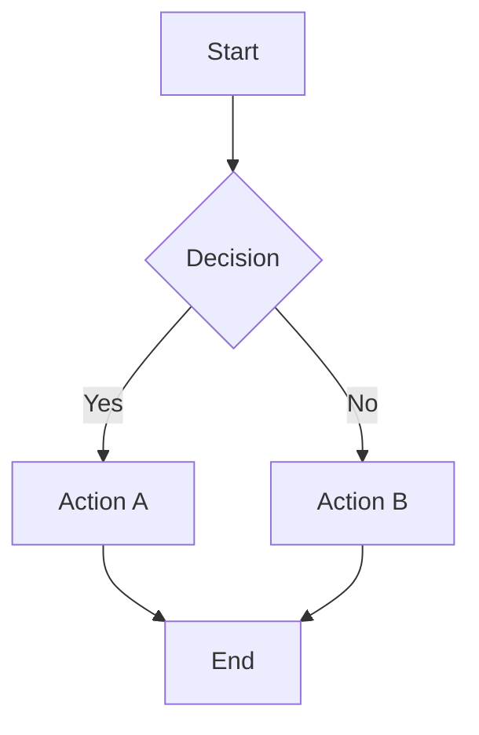
```

**Rendered output**: A flowchart with start node, decision diamond, two action paths, and an end node.

---

## 4) GitHub.com public repository (automatic enablement)

**No configuration needed.** Mermaid is enabled by default.

To verify Mermaid is working:

1. Create or edit a README.md file in your repository
2. Add a Mermaid code block:

```markdown
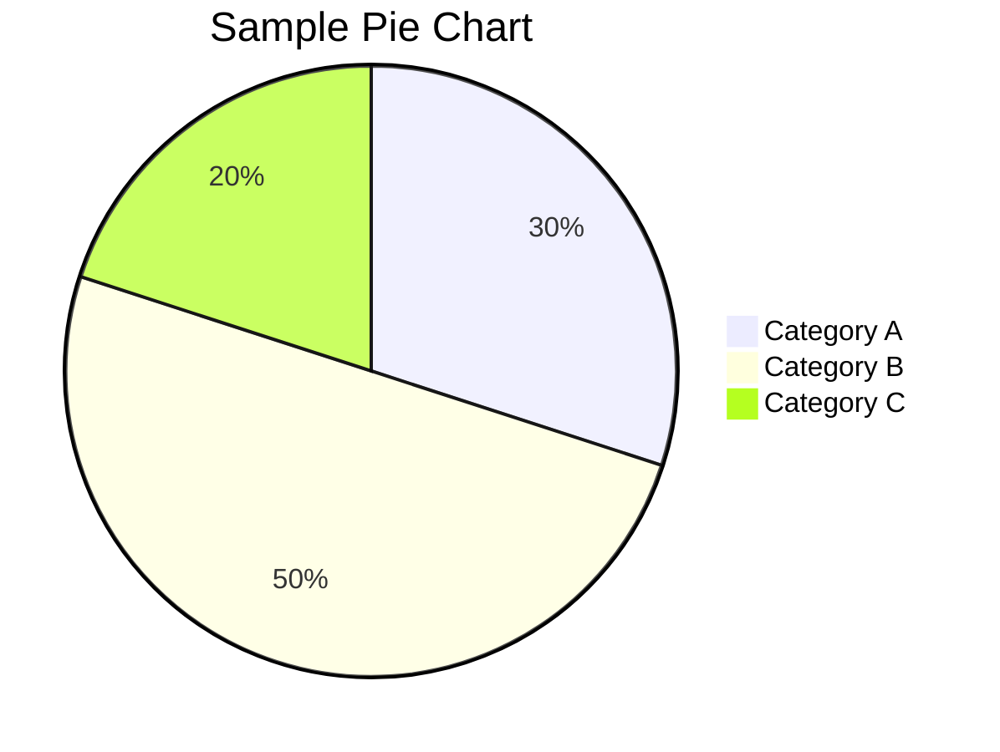
```

3. Commit and push
4. Verify the diagram renders in the GitHub web interface

---

## 5) GitHub.com private repository (automatic enablement)

**No configuration needed.** Mermaid is enabled by default on private repositories.

Same steps as public repositories—Mermaid diagrams will render automatically.

---

## 6) GitHub Enterprise Server (admin configuration)

For GitHub Enterprise Server (self-hosted), a site administrator must enable Mermaid rendering.

**Steps to enable Mermaid:**

1. Sign in to GitHub Enterprise Server as a site administrator
2. Navigate to **Site admin** (top-left corner)
3. Go to **Settings** → **Security** or **Features**
4. Look for **Mermaid diagram rendering** or **Rendering engines**
5. Enable the checkbox for **Enable Mermaid diagram rendering**
6. Click **Save** or **Apply changes**

After enabling, Mermaid diagrams will render on:
- README files
- Issues
- Pull requests
- Comments
- Discussions
- Wiki pages

---

## 7) Using Mermaid in different contexts

### In README.md

```markdown
# Project Architecture

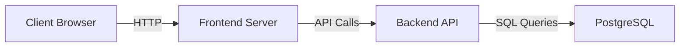

## Deployment

The system deploys via GitHub Actions...
```

### In Issues

```markdown
## Bug: Payment processing fails

When users submit payment, the following flow fails:

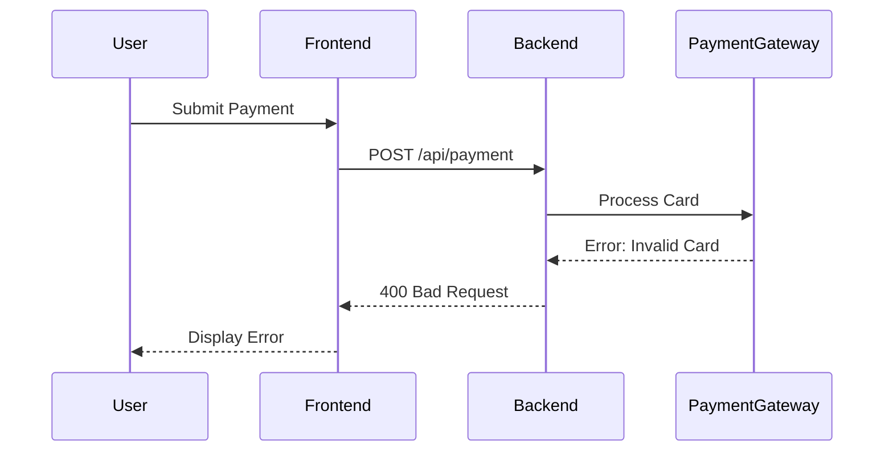

Expected: Payment should process without error.
```

### In Pull Requests

```markdown
## Changes Made

This PR implements the new user dashboard with the following flow:

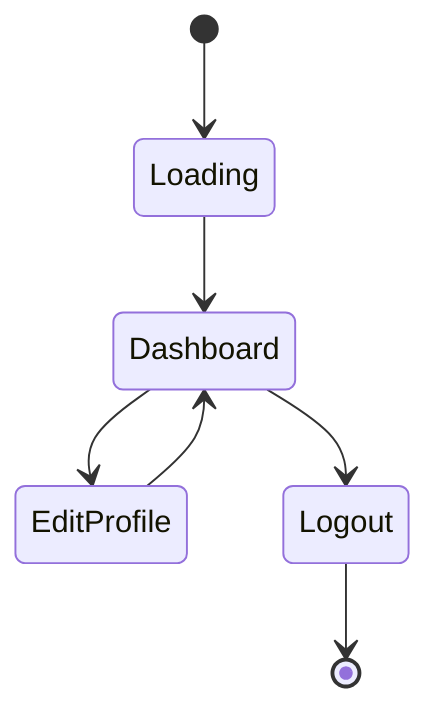

Closes #1234
```

### In Comments

```markdown
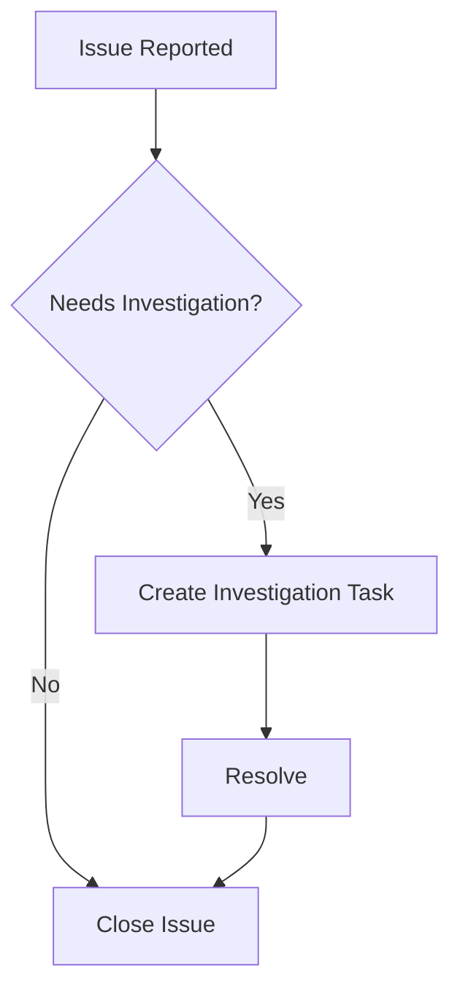

I think we should investigate this further. See flow above.
```

---

## 8) Supported Mermaid diagram types

### Flowchart / Graph

```markdown
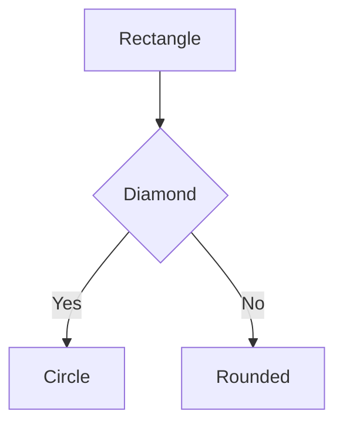
```

### Sequence Diagram

```markdown
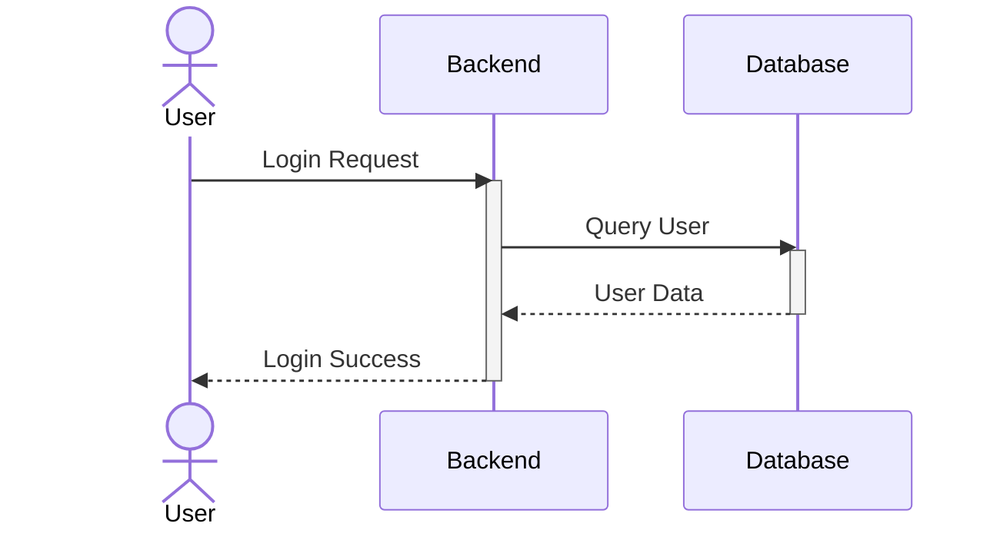
```

### Gantt Chart

```markdown
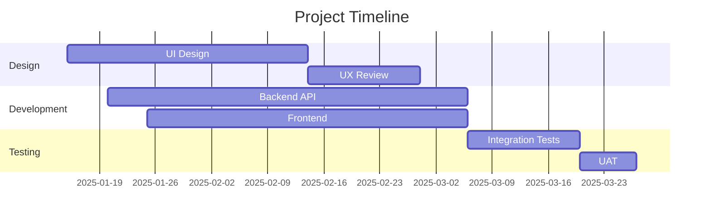
```

### State Diagram

```markdown
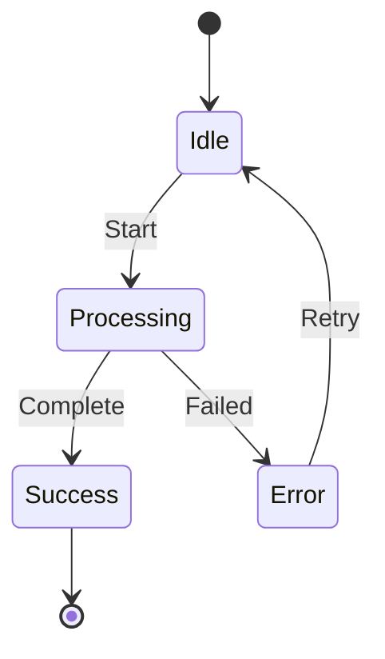
```

### Class Diagram

```markdown
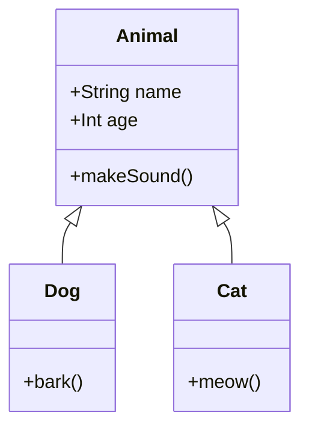
```

### Pie Chart

```markdown
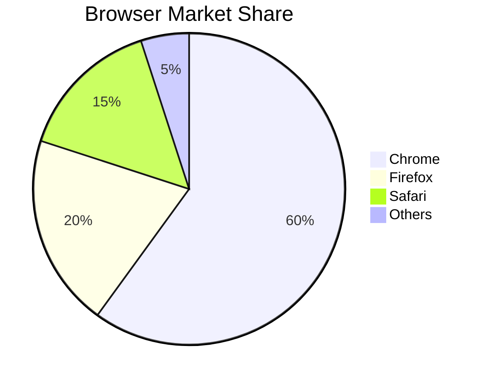
```

### Git Graph

```markdown
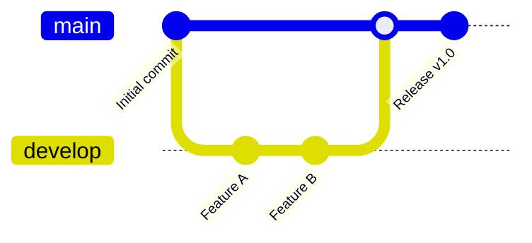
```

### Requirement Diagram

```markdown
```mermaid
requirement
    id: REQ-001
    text: System must authenticate users
    risk: high
    verifyMethod: test
```
```

---

## 9) Viewing Mermaid diagrams offline

Mermaid diagrams require JavaScript to render. If you want to view them offline:

**Option 1: Use VS Code extension**
- Install "Markdown Preview Mermaid Support" extension
- Open Markdown file preview in VS Code
- Mermaid diagrams will render locally

**Option 2: Use online editor**
- Visit https://mermaid.live
- Paste your Mermaid code
- View diagram instantly

**Option 3: Render to image**
- Use `mermaid-cli`: `npm install -g @mermaid-js/mermaid-cli`
- Command: `mmdc -i diagram.mmd -o diagram.png`
- Generates PNG/SVG file from Mermaid code

---

## 10) Disabling Mermaid in specific contexts

Mermaid cannot be globally disabled on GitHub.com, but you can:

1. **Use code fence without `mermaid` identifier** — displays as plain code:
```markdown
```
graph TD
    A --> B
```
```

2. **Reference external image instead** — upload diagram as PNG/SVG:
```markdown

```

3. **HTML comment to disable rendering** (limited effectiveness):
```markdown
<!-- 

-->
```

---

## 11) Performance considerations

- **Large diagrams**: Mermaid renders client-side; very complex diagrams may be slow
- **Browser compatibility**: Modern browsers required (Chrome, Firefox, Safari, Edge)
- **JavaScript required**: Diagrams won't render if JavaScript is disabled
- **Network latency**: Mermaid library loads from CDN; slow networks may delay rendering

**Best practices:**
- Keep diagrams readable and not overly complex
- Test diagrams in multiple browsers
- Provide alternative text description for accessibility

---

## 12) Accessibility and alt text

Mermaid diagrams are SVG-based but may not be fully accessible. Add descriptive text:

```markdown
## System Architecture

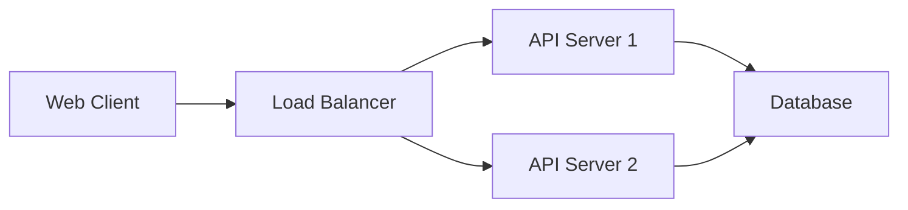

**Description**: This diagram shows a web client connecting through a load balancer to multiple API servers, which all connect to a shared database for data persistence.
```

---

## 13) Troubleshooting

| Issue | Solution |
|-------|----------|
| Diagram not rendering | Ensure code fence uses `mermaid` language identifier |
| Syntax error shown | Check Mermaid syntax at https://mermaid.live |
| Diagram renders as code | Verify markdown rendering is enabled in repo settings |
| Too slow to load | Simplify diagram; reduce number of nodes/edges |
| Works on GitHub, not locally | Install VS Code Mermaid extension for local preview |
| Enterprise Server: Not rendering | Admin must enable in Site settings → Features |

---

## 14) GitHub Enterprise Server specific steps

For **GitHub Enterprise Server** administrators:

**Enable Mermaid via command line** (if needed):

```powershell
# SSH into GitHub Enterprise Server appliance
ssh admin@your-ghes-instance

# Access admin console
ghe-config app.mermaid.enabled true
ghe-config-apply
```

**Verify in web interface:**
- Navigate to **Site admin** → **Settings** → **Security**
- Check for **Mermaid diagram rendering** toggle
- Ensure it's enabled

---

## 15) Mermaid support matrix

| Feature | GitHub.com | GitHub Enterprise Cloud | GitHub Enterprise Server |
|---------|------------|-------------------------|--------------------------|
| Flowchart | ✅ | ✅ | ✅* |
| Sequence | ✅ | ✅ | ✅* |
| Gantt | ✅ | ✅ | ✅* |
| State | ✅ | ✅ | ✅* |
| Class | ✅ | ✅ | ✅* |
| Pie chart | ✅ | ✅ | ✅* |
| Git graph | ✅ | ✅ | ✅* |
| Requirement | ✅ | ✅ | ⚠️ Limited |

*Requires admin enablement on GitHub Enterprise Server

---

## 16) Mermaid configuration options

GitHub supports basic Mermaid configuration via code fence options (limited):

```markdown
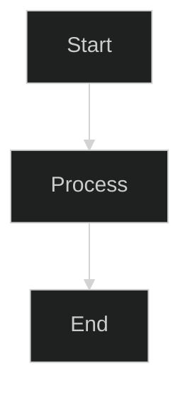
```

**Available themes:**
- `default` — light theme
- `dark` — dark theme
- `neutral` — neutral colors
- `forest` — green theme

---

## 17) Real-world examples

**Example 1: API Request Flow**
```markdown
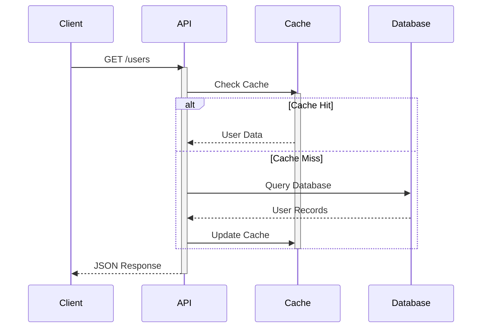
```

**Example 2: Deployment Pipeline**
```markdown
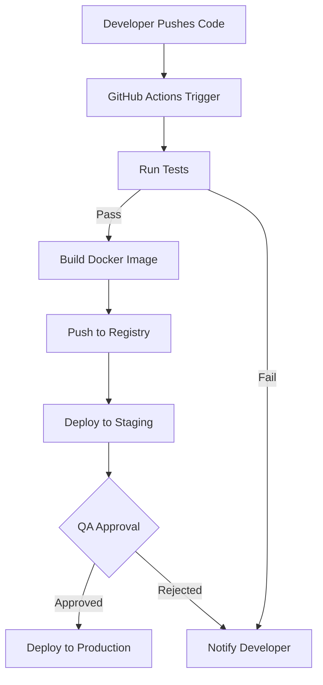
```

**Example 3: Database Schema**
```markdown
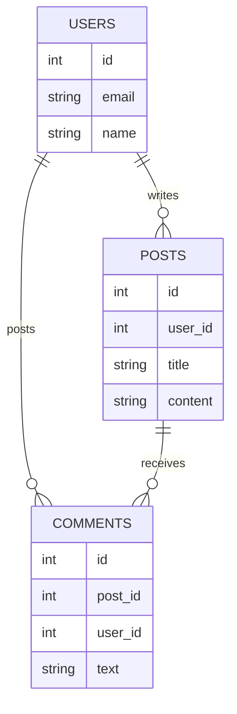
```

---

## 18) Tips and best practices

1. **Keep it simple**: Use Mermaid for reasonably complex diagrams; for simple ones, use plain text or images.
2. **Test rendering**: Preview diagrams in GitHub before merging to main branch.
3. **Use consistent shapes**: Use the same node shape for similar concepts.
4. **Provide fallback**: Include descriptive text alongside diagrams for accessibility.
5. **Version diagrams**: Store diagram source in repo; regenerate if Mermaid updates syntax.
6. **Document intent**: Add comments explaining what the diagram represents.

---

## 19) Integration with GitHub Actions

Use Mermaid diagrams in GitHub Actions workflow documentation:

```markdown
## CI/CD Workflow

```mermaid
graph LR
    A["Pull Request"] --> B["Run Tests"]
    B -->|Pass| C["Build"]
    B -->|Fail| D["Notify PR"]
    C --> E["Deploy to Staging"]
    E --> F["Run E2E Tests"]
    F -->|Pass| G["Approve Merge"]
    F -->|Fail| D
```

See `.github/workflows/ci.yml` for automation details.
```

---

## 20) Resources

- Mermaid official documentation: https://mermaid.js.org/
- Mermaid live editor: https://mermaid.live
- GitHub Markdown diagrams: https://docs.github.com/en/get-started/writing-on-github/working-with-advanced-formatting/creating-diagrams
- Mermaid syntax reference: https://mermaid.js.org/syntax/flowchart.html
- GitHub Enterprise Server docs: https://docs.github.com/en/enterprise-server@latest

---

**Pro tip**: Use the Mermaid live editor (https://mermaid.live) to design and test your diagrams before adding them to GitHub. This helps ensure they render correctly and catches syntax errors early.